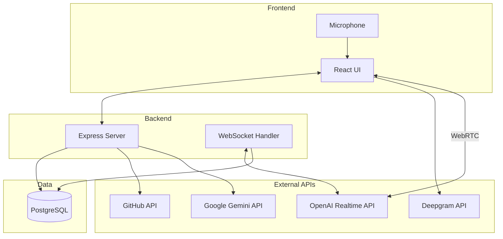
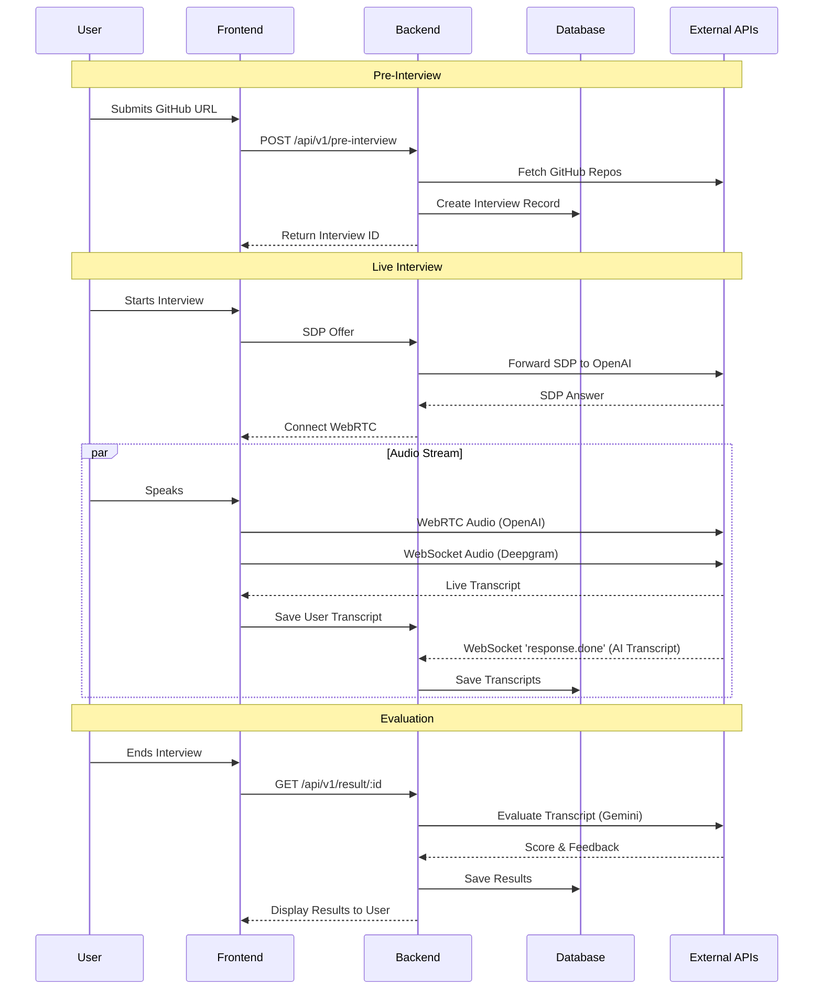

# HireSensei.ai - AI Interview Platform

HireSensei.ai is an automated technical interviewing platform. It reviews a candidate's GitHub profile, conducts a live voice interview, and provides automated grading.

## Unique Selling Proposition (USP)

The core differentiator of this platform is its server-side "sideband" websocket architecture.

### Key Differentiators
- **Security:** Interview logic and prompts are stored securely on the backend, preventing client-side manipulation.
- **Stateful Evaluation:** Audio and conversation data are processed through the backend for real-time monitoring and grading.
- **Advanced Voice Integration:** Uses WebRTC with OpenAI's Realtime API for fast, human-like voice interaction, while recording the session.
- **Context-Aware Interviews:** Scrapes external data (like GitHub profiles) to generate personalized questions for the candidate.

## System Architecture



### Components
1. **Frontend (apps/frontend):** React app that captures microphone audio. It uses WebRTC to stream audio to OpenAI and WebSockets to stream audio to Deepgram for live transcription.
2. **Backend (apps/backend):** Express server running on Bun. It manages interview state, scrapes GitHub data, handles WebRTC handshakes, and evaluates interviews using Google Gemini.
3. **Database (Prisma + PostgreSQL):** Stores interview metadata, transcripts, and final grades.

## End-to-End Flow



## Getting Started

1. **Install Dependencies**
   ```bash
   bun install
   ```

2. **Configuration**
   Create a `.env` file in `apps/backend` with:
   - `DATABASE_URL`
   - `OPENAI_KEY`
   - `GEMINI_API_KEY`
   - `PROXY_URL` (optional)

3. **Database Setup**
   ```bash
   cd apps/backend
   bunx prisma db push
   ```

4. **Run Application**
   ```bash
   bun run dev
   ```